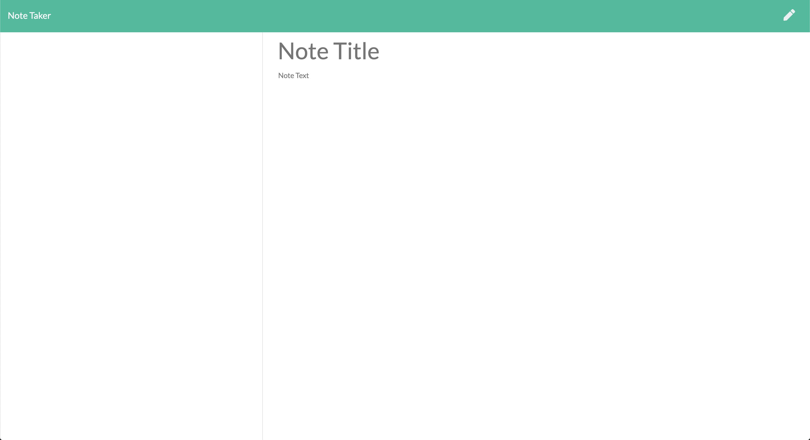

# Note-Taker
This is a very simple note application. You can create new note, view all saved notes, and detele selected note. All notes saved in a JSON file. 

- [Setup](#setup)
- [Credit](#credit)
- [Link](#link)
- [License](#license)

## Setup
There's a link below.

## Credit
Node.js

Express

Heroku

## Link
[Note-Taker](https://limitless-woodland-46603.herokuapp.com)

## Screenshot

## License

[MIT License](LICENSE)